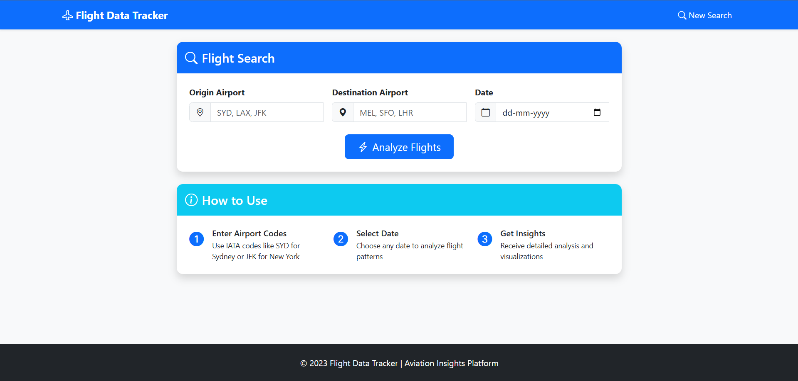
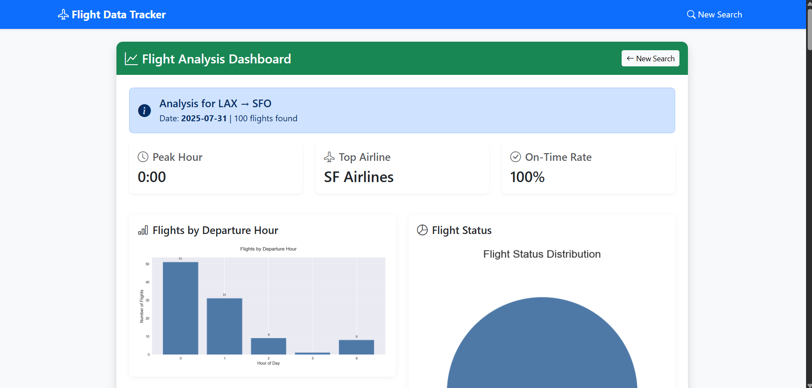

# Airline Demand Analyzer

A web application that analyzes airline booking market demand by fetching real-time flight data, processing it, and providing visual insights.

## Features

- Real-time flight data from AviationStack API
- Data visualization with Matplotlib
- AI-powered insights using OpenAI
- Responsive web interface
- REST API endpoint for integration

## Setup Instructions

1. Clone the repository:
   ```bash
   git clone https://github.com/yourusername/airline_demand_analyzer.git
   cd airline_demand_analyzer
   ```

2. Create and activate a virtual environment:
   ```bash
   python -m venv venv
   source venv/bin/activate  # On Windows: venv\Scripts\activate
   ```

3. Install dependencies:
   ```bash
   pip install -r requirements.txt
   ```

4. Create a `.env` file in the project root with your API keys:
   ```
   AVIATIONSTACK_API_KEY=your_api_key_here
   OPENAI_API_KEY=your_openai_key_here
   SECRET_KEY=your_secret_key_here
   ```

5. Run the application:
   ```bash
   python app.py
   ```

6. Access the web interface at `http://localhost:5000`

## API Usage

You can also access the data via API:
```
GET /api/flights?origin=SYD&destination=MEL&date=2023-07-25
```

## Dependencies

- Flask - Web framework
- Requests - HTTP requests
- Pandas - Data processing
- Matplotlib - Data visualization
- OpenAI - AI insights
- python-dotenv - Environment variables

## Screenshots




## Limitations

- Free API tiers have limited requests
- Data availability depends on API providers